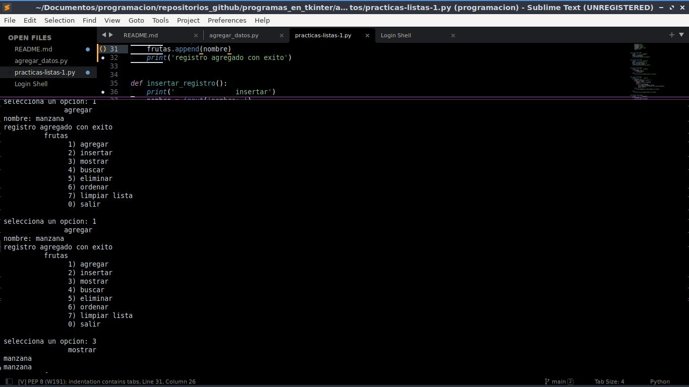
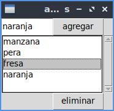
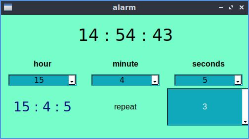
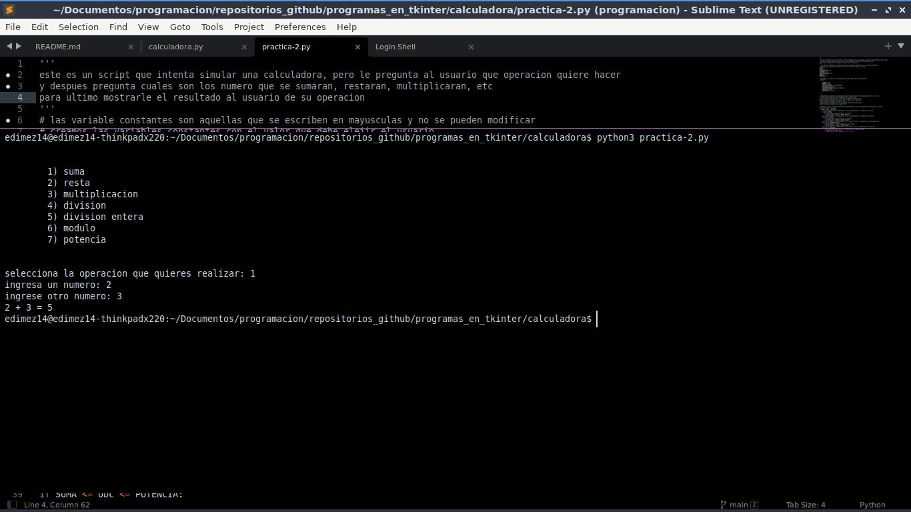
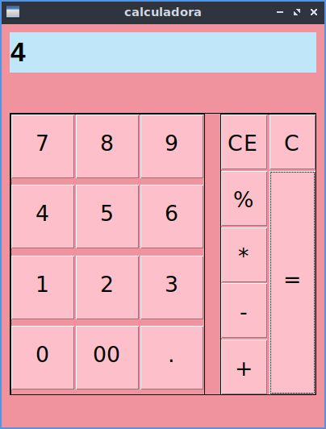
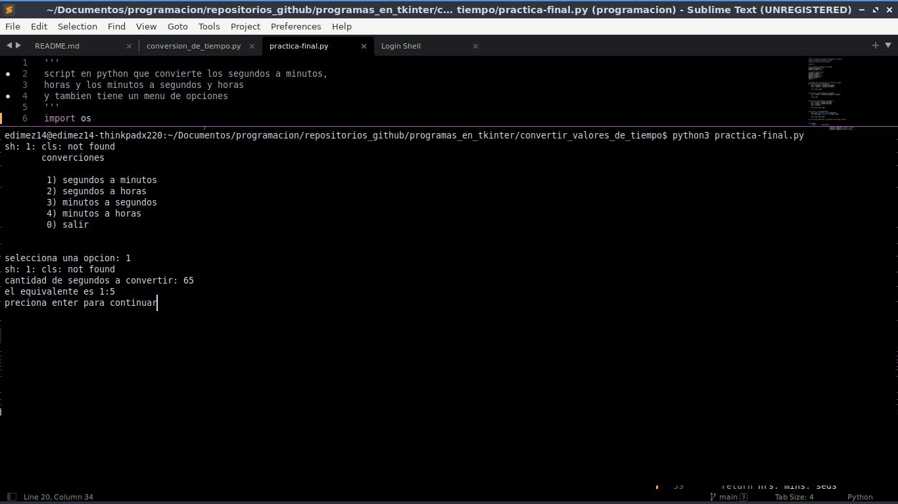
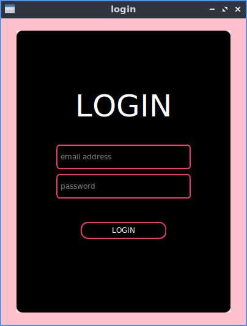

# programas en tkinter
en este repositorio se podra encontrar diferentes practicas realizadas con la libreriria de python tkinter

### agregar datos
\n
captura de funcionamiento de la version de consola

\n
captura de funcionamiento de la version de GUI con tkinter

### alarma
\n
captura del funcionamiento de la version de GUI con tkinter del programa de alarma

### calculadora
\n
captura de funcionamiento de la version de consola de la caculadora

\n
captura de funcionamiento de la version de GUI con tkinter de la calculadora

### convertidor de valores de tiempo
\n
captura de funcionamiento de la version de consola del conversor de timepo

\n
captura de funcionamiento de la version de GUI con tkinter del conversor de tiempo

### interfaz de usuario (login)
\n
captura de funcionamiento de la version de GUI con customtkinter del login